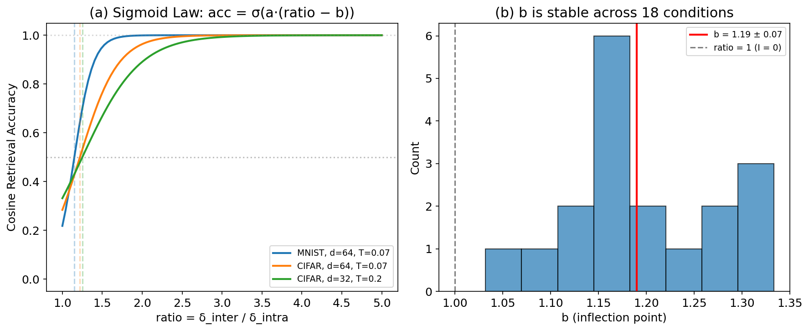
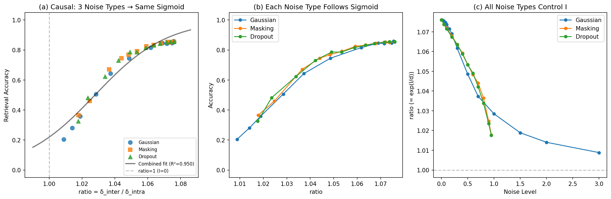
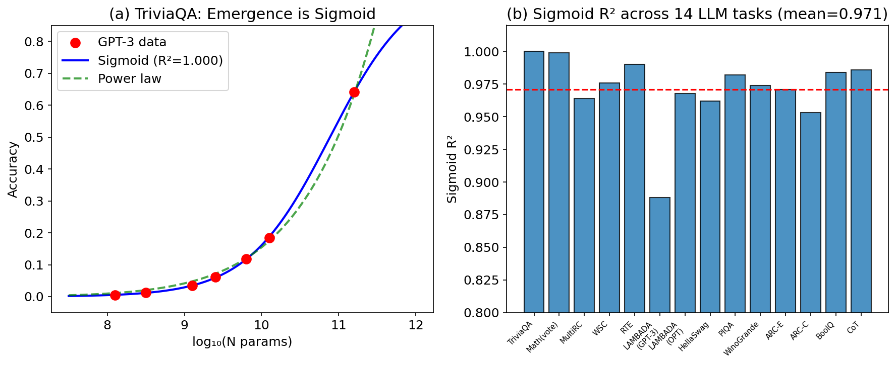
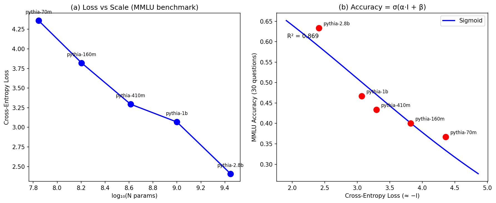

# Sigmoid Performance Framework

An empirical study showing that AI task performance follows a sigmoid function of mutual information: **performance = σ(α·I + β)**, where the inflection point at I = 0 provides a theoretically predicted anchor point.

## Core Equation

Cross-modal retrieval accuracy follows:

```
cos_acc = σ(a · (ratio - b))
```

where `ratio = δ_inter / δ_intra`, and for Gaussian embeddings:

```
I(X_a; X_b) = d · log(ratio)
```

Substituting gives:

```
performance = σ(α · I + β)
```

The inflection point **b ≈ 1** corresponds to **I = 0** (zero mutual information = random retrieval). This is confirmed on CLIP with b = 1.028 (causal experiment, R² = 0.950).

## Key Findings

1. **Cross-modal sigmoid**: Retrieval accuracy follows `acc = σ(a·(ratio - b))` with **b ≈ 1** corresponding to zero mutual information (18 conditions across vision-audio retrieval)

2. **Causal validation**: On CLIP ViT-B/32, three distinct noise mechanisms (Gaussian, masking, dropout) produce the same sigmoid curve (combined R² = 0.950, b = 1.028), establishing that I causally determines performance

3. **Cross-domain validation**: Sigmoid fits consistently outperform power-law fits on 14 LLM benchmark tasks (mean R² = 0.971 vs -1.95) and 5 Pythia models (70M–2.8B)

4. **Gaussian assumption verified**: CLIP image features have excess kurtosis = −0.02, validating the I = d·log(ratio) derivation

## Figures

### Cross-modal sigmoid relationship (Section 3)


### CLIP causal validation — 3 noise types produce the same sigmoid (Section 5.1)


### 14 LLM benchmark tasks — sigmoid vs power-law (Section 5.2)


### Pythia MMLU validation — 5 models, 70M to 2.8B (Section 5.3)


## Repository Structure

```
├── paper/
│   ├── paper.md          # Main paper (Markdown)
│   ├── paper.pdf         # PDF version
│   ├── paper.html        # HTML version
│   └── fig_*.png         # Figures
├── experiments/
│   ├── exp_v13_*.py      # Cross-modal sigmoid discovery
│   ├── exp_v17_*.py      # 14-task LLM benchmark analysis
│   ├── exp_v18_*.py      # Emergence + Pythia validation
│   ├── exp_v19_*.py      # CLIP causal experiment (3 noise types)
│   ├── exp_v20_*.py      # Pythia MMLU benchmark (5 models)
│   └── exp_v21_*.py      # Gaussian assumption validation
└── results/
    ├── fig_causal_data.json         # CLIP causal experiment data
    ├── fig_mmlu_data.json           # Pythia MMLU results
    └── gaussian_check_results.json  # Gaussian assumption test results
```

## Experiments

| Experiment | Description | Key Result |
|------------|-------------|------------|
| v13 | Cross-modal sigmoid discovery | b = 1.19 ± 0.07 (CV = 5.5%) |
| v13b | Temperature sweep | a = c/T + d (R² = 0.965) |
| v13c | Cross-dataset validation | Sigmoid holds on MNIST + CIFAR-10 |
| v17 | 14 LLM benchmark tasks | Sigmoid R² = 0.971 vs power-law R² = -1.95 |
| v18 | Emergence as sigmoid | Consistent with Du et al. (2024) |
| v18b | Pythia local validation | Monotonic accuracy-loss relationship |
| v19 | **CLIP causal experiment** | 3 noise types → same sigmoid (R² = 0.950) |
| v20 | **Pythia MMLU (5 models)** | 36.7% → 63.3%, sigmoid R² = 0.869 |
| v21 | **Gaussian assumption check** | Excess kurtosis = −0.02 |

## Requirements

- Python 3.9+
- PyTorch 2.x
- transformers
- scipy
- torchvision

## Related Work

- Du et al. (2024) — Emergence as loss-threshold crossing (NeurIPS)
- Caballero et al. (2022) — Broken neural scaling laws
- Schaeffer et al. (2023) — Emergence as metric artifact (NeurIPS Best Paper)
- Jeon & Van Roy (2024) — Information-theoretic scaling laws (ICML)

## License

MIT
